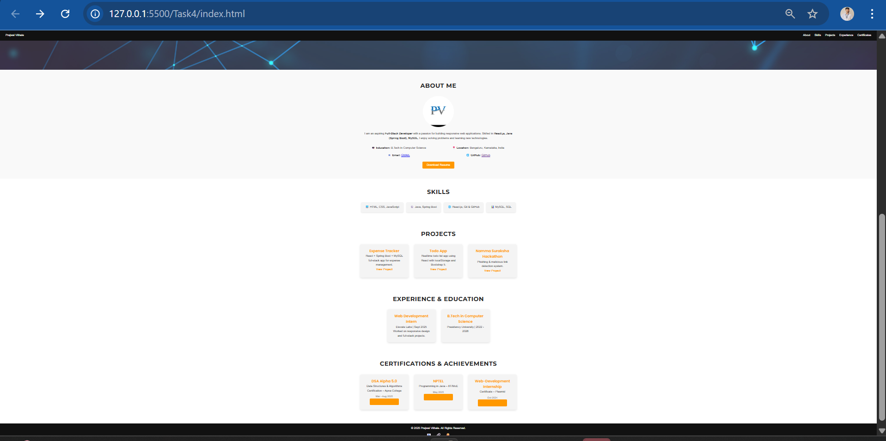

# 📱 Task 4 - Make a Website Mobile-Friendly Using CSS Media Queries

## 📋 Objective
Convert an existing desktop-only webpage into a **mobile-friendly layout** using **CSS media queries**.

---

## ✨ Main Features
- Responsive design using `@media` queries  
- Layout adapts for desktop, tablet, and mobile  
- Images scale properly  
- Font sizes and spacing optimized for readability  

---

## 🌐 About My Portfolio
This project is my **personal portfolio website** with the following sections:  
- About Me  
- Skills  
- Projects  
- Experience & Education  
- Achievements & Certificates  

---

## 📸 Screenshots

### 💻 Desktop View

### 📱 Tablet View

### 📱 Mobile View

### 📱 About Section View

---

## 🛠️ Tools & Technologies
- **HTML5**  
- **CSS3 (Flexbox, Grid, Media Queries)**  
- **JavaScript**  

---

## 📂 Deliverable
Website is now **fully responsive** and works across desktop, tablet, and mobile.
